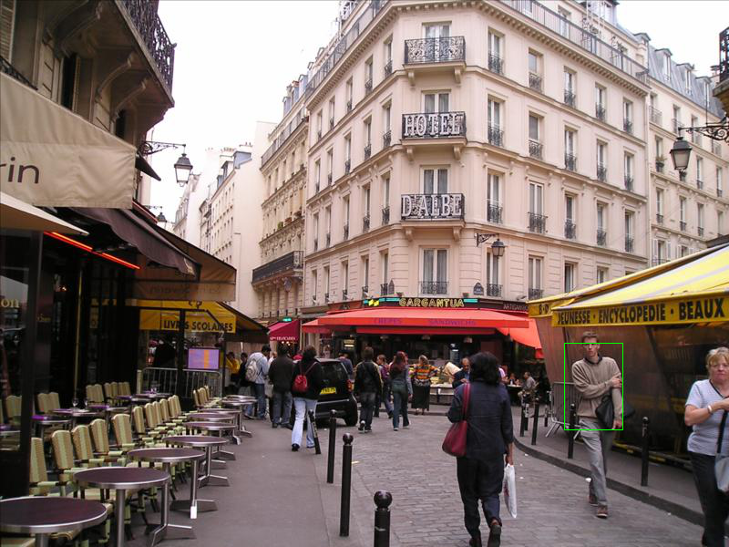

# textobjdetection
Code for the Human-related Object Detection based on Natural Language Parsing of Image
Query Expressions article

## Project status
[](./LICENSE)

## Dependencies

To execute this, you must have Python 3.6.*, [PyTorch](http://pytorch.org/), [OpenCV](http://opencv.org/), [Numpy](http://www.numpy.org/) and [Matplotlib](https://matplotlib.org/) installed, to accomplish this, we recommend installing the [Anaconda](https://www.continuum.io/downloads) Python distribution and use conda to install the dependencies, as it follows:

```bash
conda install pytorch torchvision cuda80 -c soumith
conda install opencv3 -c menpo
conda install matplotlib numpy
conda install aria2 -c bioconda
pip install visual-genome
```

## Dataset download
You must download the [Visual Genome](http://visualgenome.org/api/v0/api_home.html) dataset, as well the train/val/test split used for our experiments. For this, we provide the ``download_dataset.sh`` bash script, it will take care of the downloads required.

## Pretrained models
Pretrained SSD + LSTM weights are provided as proof of our experimients. They are available at:

* **LSTM Model:** https://s3-sa-east-1.amazonaws.com/textobjdetection/lstm_model.pt
* **SSD Model:** https://s3-sa-east-1.amazonaws.com/textobjdetection/ssd_lang.pt

After downloading the models, they must be uncompressed under the ``weights`` folder.

## Demo
A simple demo is provided as a [Jupyter Notebook](Demo.ipynb), here you can load images and predict bounding boxes given a object query phrase.



## Acknowledgements
The SSD multibox detector is based on amdegroot's PyTorch implementation: https://github.com/amdegroot/ssd.pytorch

## Contributions
Any contribution Pull Request will reviewed as part of Open Source initiative. We follow PEP8 and PEP257 guidelines
